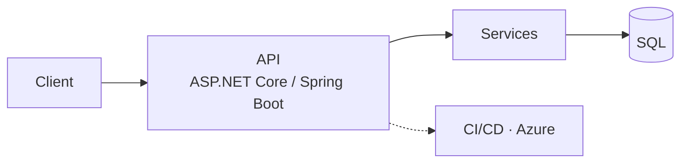

  
  
  

 

### Tech Stack

  

### AI-Assisted Engineering

  

### Flow

```mermaid
flowchart LR
    A[Client] --> B[API<br/>ASP.NET Core / Spring Boot] --> C[Services] --> D[(SQL)]
    B -.-> E[CI/CD · Azure]
```

 

### GitHub Stats

 

